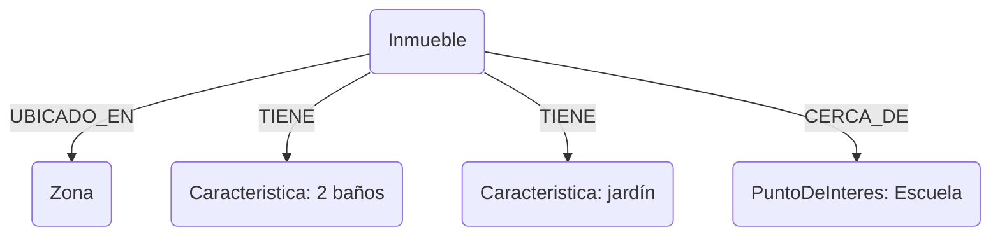

## Arquitectura de Datos
Integración de Fuentes Dispersas y Consulta mediante IA

---

#### **Diagnóstico: Fragmentación y Latencia de Datos**

- **Fuentes Múltiples:** Datos en planillas aisladas impiden consultas cruzadas.
- **Problemática:** La obtención de insights depende de la consolidación y análisis manual, un proceso lento y propenso a errores.
- **Consultas Limitadas:** Las estructuras actuales no permiten analizar relaciones complejas de forma (ej: `comprador` -> `prioriza` -> `jardín` -> `comparte características con` -> `casa con patio trasero`).

---

### **Capacidad Objetivo: Consultas Complejas en Lenguaje Natural**

El sistema permitirá a un usuario de Citrino ejecutar consultas como:

> *"Listar inmuebles con más de 2 baños, en la zona X, que coincidan con las características de los inmuebles mencionadas por prospecto con un presupuesto superior a 150.000$. (ej: cerca de colegio y supermercado)"*

La plataforma traducirá esta petición a una consulta optimizada y devolverá los resultados estructurados precisos.

---

### **Arquitectura del sistema**

#### Componentes y Flujo de Datos

1.  **Ingesta y ETL:** Scripts de Python para extraer, transformar y cargar datos desde las fuentes (censo inmobiliario, guía urbana, censo nacional) a un formato unificado.
2.  **Base de Datos de Grafos (Neo4j):** Almacenamiento centralizado. Seleccionada por su rendimiento superior en consultas de alta conectividad.
3.  **API de Consulta (Cherry Studio):** Provee el endpoint que recibe las peticiones en lenguaje natural.
4.  **Orquestador de LLMs (OpenRouter):** Gestiona la traducción de la petición a una consulta Cypher (el lenguaje de Neo4j), optimizando costo y precisión.

---

### **Por qué Neo4j**

#### Análisis Comparativo: Modelo Relacional vs. Modelo de Grafo

-   **Modelo Relacional (ej. PostgreSQL):**
    -   Requiere múltiples `JOINs` para consultas de 3 o más niveles de relación.
    -   El rendimiento se degrada exponencialmente con la complejidad de la consulta.

-   **Modelo de Grafo (Neo4j):**
    -   Las relaciones son entidades de primer nivel.
    -   Las consultas atraviesan conexiones directas, manteniendo un rendimiento alto y predecible.

-   **Conclusión:** Para el caso de uso de Citrino, centrado en relaciones, el modelo de grafo reduce la latencia de las consultas complejas en órdenes de magnitud.

---
### **Plan de Implementación: Prueba de Concepto (PoC)**

-   **Objetivo:** Validar la viabilidad de la arquitectura propuesta y el flujo de datos completo a escala reducida.
-   **Alcance Definido:**
    -   **Dataset:** 5 inmuebles, datos del censo asociados, 10 perfiles de cliente.
    -   **Funcionalidad:** Capacidad de ingestar estos datos y ejecutar 3 tipos de consultas predefinidas en lenguaje natural.
-   **Entregable:** Un endpoint funcional y una demostración grabada del proceso.

---

### **Diapositivas de Avance**

---

**(Diapositiva 7: Alcance de Datos de la PoC)**
### **Dataset Utilizado en la Prueba de Concepto**
*Se detalla el subconjunto de datos específico con el que se trabajó para validar la arquitectura.*
-   **Inmuebles Analizados:** 5 propiedades seleccionadas del Censo Inmobiliario de Citrino.
    -   *Zona:* [Ej: Zona Norte]
    -   *Unidad Vecinal:* [Ej: UV-15, UV-22]
    -   *IDs de Inmuebles:* [Ej: 101, 102, 103, 104, 105]
-   **Datos de Prospectos:** Información complementaria recopilada por asesores.
    -   *Atributos clave:* [Ej: Composición familiar, presupuesto, necesidades específicas]
-   **Puntos de Interés (Guía Urbana):**
    -   *Categorías incluidas:* Escuelas, Supermercados, Hospitales.
    -   *Radio de búsqueda:* [Ej: 1 km alrededor de cada inmueble]

---

**(Diapositiva 8: Proceso de Implementación - ETL)**
### **Paso 1: Extracción y Unificación de Datos (ETL)**
*Se muestra cómo las fuentes dispares se convirtieron en un modelo de datos cohesivo.*
-   **Censo Inmobiliario:** Script de Python para leer `.xlsx` y extraer campos clave (dirección, m², baños, etc.).
-   **Guía Urbana:** Script para procesar `.csv` de puntos de interés y geolocalizarlos.
-   **Recolección de Prospectos:** Script para procesar datos de prospectos recopilados por asesores Citrino y asociarlos a propiedades potenciales.
-   **Resultado:** Un conjunto de datos limpio y estructurado, listo para ser cargado en la base de datos.

*(**Nota:** Aquí podrías mostrar un pequeño snippet de código o un diagrama simple del flujo si quieres ser más técnico.)*

---

**(Diapositiva 9: Proceso de Implementación - Base de Datos)**
### **Paso 2: Modelado y Creación de la Base de Datos de Grafo**
*Visualización del esquema de datos en Neo4j, el núcleo de la solución.*
-   **Nodos Principales:**
    -   `Inmueble`: Representa cada propiedad.
    -   `Caracteristica`: Atributos como "piscina", "2 baños", "jardín".
    -   `PuntoDeInteres`: Escuelas, supermercados, etc.
    -   `Zona`: Unidad Vecinal o barrio.
-   **Relaciones Clave:**
    -   `Inmueble -[TIENE]-> Caracteristica`
    -   `Inmueble -[UBICADO_EN]-> Zona`
    -   `Inmueble -[CERCA_DE]-> PuntoDeInteres`

*(**Sugerencia:** Aquí es perfecto generar un diagrama con Mermaid para visualizar el grafo. Puedo crearlo por ti.)*

---

**(Diapositiva 10: Proceso de Implementación - API y Consulta)**
### **Paso 3: Configuración del Endpoint de Consulta**
*Explicación de cómo se conectó la IA para permitir las consultas en lenguaje natural.*
-   **Cherry Studio:** Configurado como el servidor API que expone un único endpoint.
-   **Conexión a Neo4j:** Se estableció el driver de conexión para que la API pueda ejecutar consultas Cypher.
-   **Orquestador (==OpenRouter==):** Se diseñó un prompt específico que instruye al LLM para que traduzca las preguntas del usuario a consultas Cypher válidas, utilizando el esquema de nuestro grafo. (==no me convence este punto, OpenRouter es solo para elegir diferentes LLM==)

*(**Nota:** Esta diapositiva explica la "magia" detrás de la traducción de lenguaje natural a consultas de base de datos.)*

---

**(Diapositiva 11: Resultados de la Prueba de Concepto)**
### **Demostración: Consultas Ejecutadas y Resultados**
*La prueba final. Se muestran ejemplos concretos de la capacidad del sistema.*

**Consulta 1:** `"Listar inmuebles en la Zona Norte con jardín"`
-   **Cypher Generado:** `MATCH (i:Inmueble)-[:UBICADO_EN]->(z:Zona {nombre: 'Zona Norte'}) WHERE (i)-[:TIENE]->(:Caracteristica {nombre: 'jardín'}) RETURN i.direccion`
-   **Resultado:** `[Inmueble ID: 102, Inmueble ID: 105]`

**Consulta 2:** `"... (segunda consulta de la PoC)..."`
-   **Cypher Generado:** `...`
-   **Resultado:** `...`

**Consulta 3:** `"... (tercera consulta de la PoC)..."`
-   **Cypher Generado:** `...`
-   **Resultado:** `...`

---
